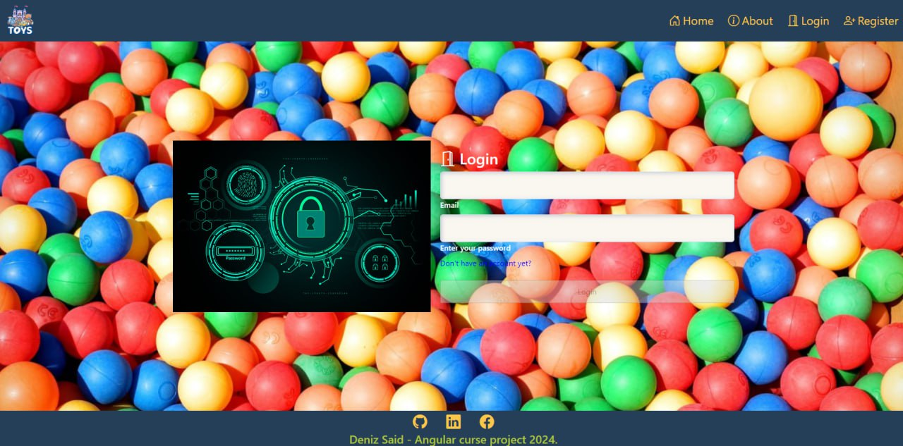
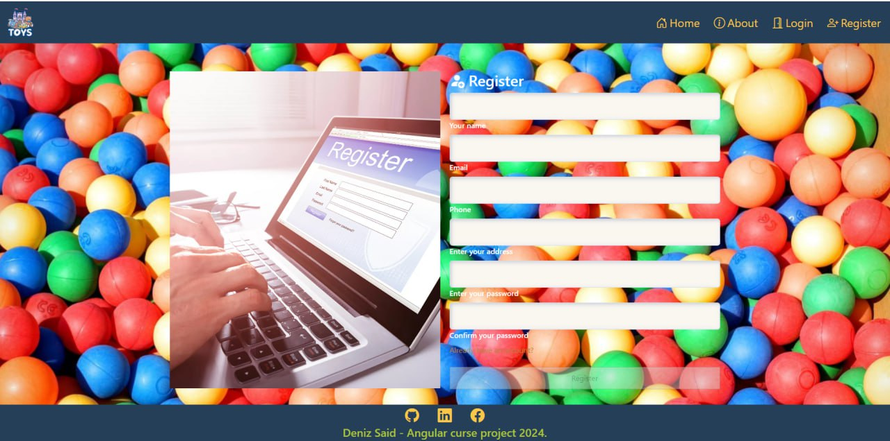
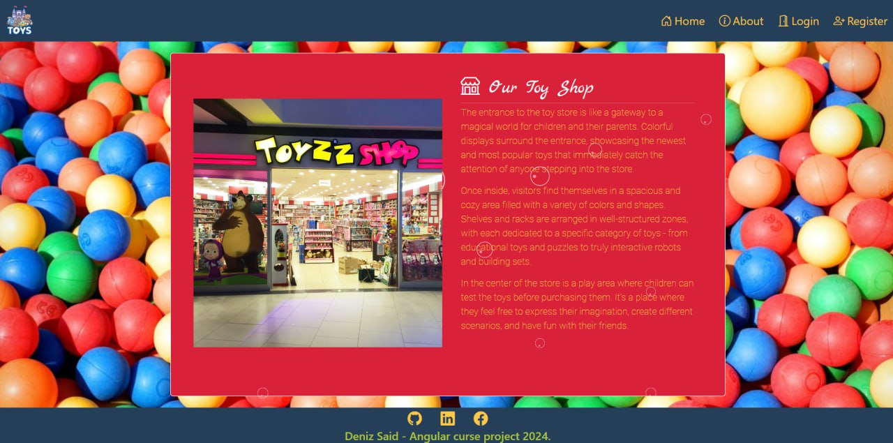
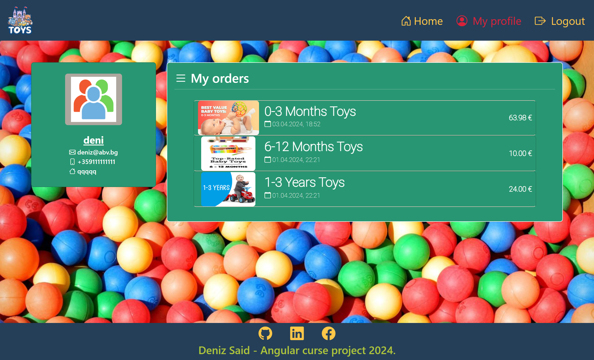
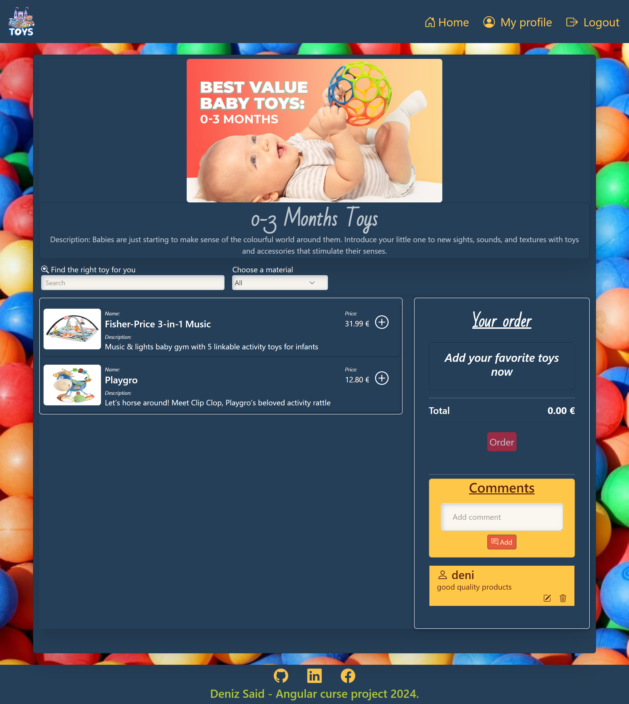

# SoftUni Angular Project - Toy Store

## You can view the site here

[Click Me](https://deniz-said-angular-project.netlify.app/)

**For testing - Admin User:**
    - Email: denizsaid@gmail.com
    - Password: 123456

**For testing - Regular User:**
    - Email: deniz@abv.bg
    - Password: 123456

## Table of Contents

1. [Introduction](#introduction)
2. [Setup-Instructions](#setup-instructions)
3. [Features](#features)
   - [User Features](#user-features)
   - [Administrator Features](#administrator-features)
4. [Screenshots](#screenshots)

## Introduction

**Toy Store** is my final project for the Angular course in SoftUni is created with Node.js, Express.js, MongoDB with Mongoose for the backend, and Angular for the frontend.

**Toy Store** is a web application that enables users to find a suitable gift (toy) for themselves or their acquaintances and make online orders at a time convenient for them. For a better user experience, the toys are filtered by category. And because user opinion is important to us, we provide the opportunity to comment on the products, which facilitates the choice compared to other users. It supports three types of user: Guest, User and Admin.

## Setup-Instructions

1. Clone the repository: **git clone https://github.com/Denisaid/SoftUni-Angular-Project.git**
2. Backend Configuration: Navigate to the `server` folder and create`.env` file. Add the following contents in file:

    ```plaintext
    PORT = 3000
    CONNECTION_STRING =
    ROUNDS_BCRYPT = 10
    JWT_SECRET = 
    ```

    **MongoDB Setup**: 
    - Sign up for an account at [MongoDB Atlas](https://www.mongodb.com/cloud/atlas).
    - Create a new cluster and follow the instructions to set up a new database.
    - Once set up, obtain your MongoDB connection string and add it to the `CONNECTION_STRING` variable in your `.env` files.

3. Running the Application

 **server**:
    - Navigate to the `server` directory.
    - Install dependencies: `npm install`.
    - Start the server: `npm start`.

 **client**:
    - Open a new terminal and navigate to the `client` directory.
    - Install dependencies: `npm install`.
    - Start the frontend application: `npm start`.

## Features

### User Features

- Overview of toys in the hotel categories
- Perform registration
- Logging into the system
- Placing an order for the selected toys
- Access to personal profile page
- Possibility to change or cancel an order in a set time interval (5 minutes)
- Ability to add a comment to products as well as edit/delete those added by them

### Administrator Features

- Create new restaurants
- Manage products for their restaurant
- Edit or delete existing restaurants and products
- View short statistics for top-selling restaurants and products
- Cannot place orders or leave comments

- Create new categories, edit and delete already created ones
- Add toys to categories
- Edit or delete toys
- Display statistics for top selling toys in categories

# Screenshots

## Home Page


## Login



## Register



## About Us



## User Profile



## Admin Profile


## Add Category


## Order


